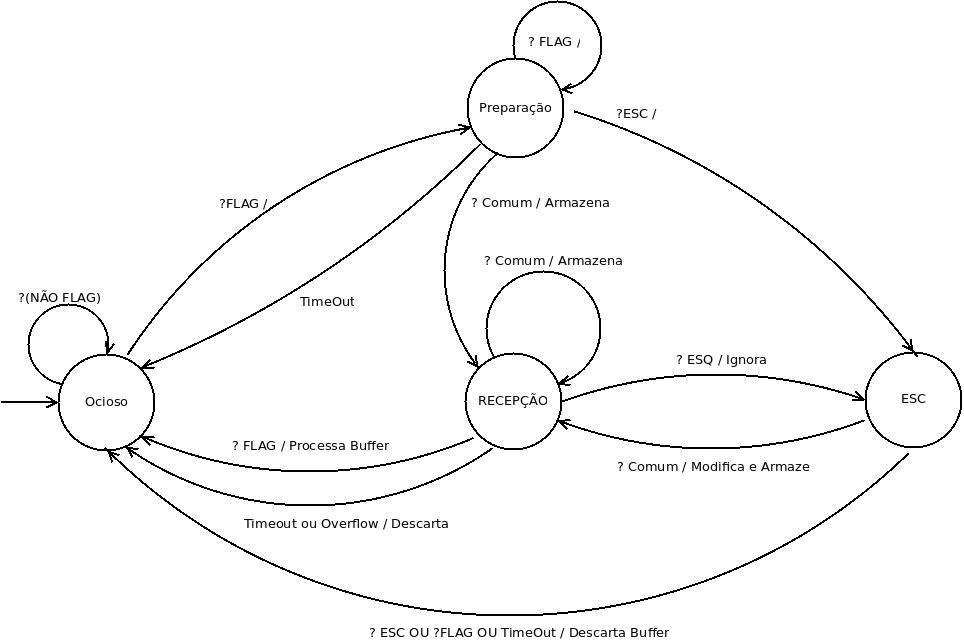
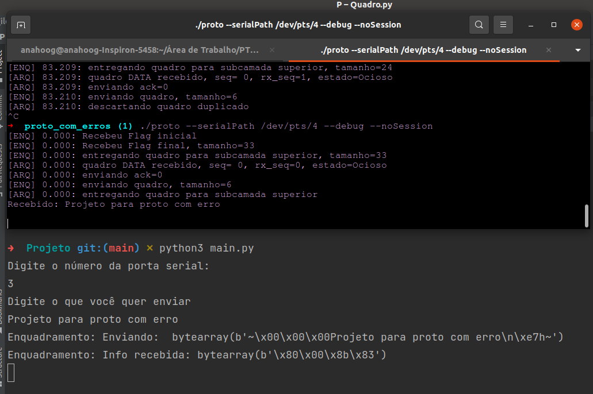
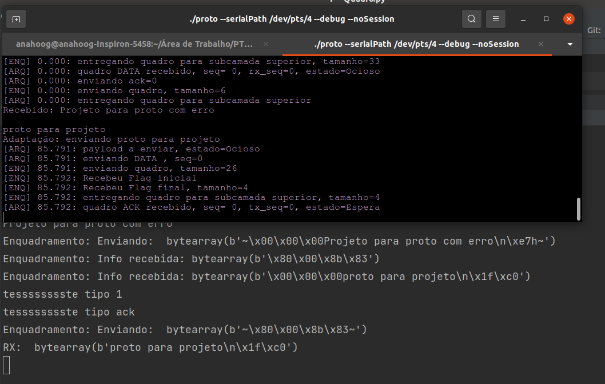

# Projeto 2 - Protocolo de Enlace

Alunos: Ana Paula Hoog, Filipe Kuhnen e Lucas da Silva

&nbsp;

## Protocolo de Enlace

### Resumo

### Aplicação

### Características

### Pré Requisitos
* Utilizar a flag com valor 7E (01111110) como delimitador de quadros
* Utilizar o byte de escape 7D (01111101) para preenchimento de octeto
* O transmissor deve fazer pelo menos o escape dos bytes 7E e 7D que aparecerem no conteúdo do quadro
* * Cada byte que sofrer o escape deve ser modificado por meio de um XOR 20. Ex: se o byte a sofrer escape for 7E, ele deve ser modificado para 5E (7E XOR 20 = 5E)

### Simulação

